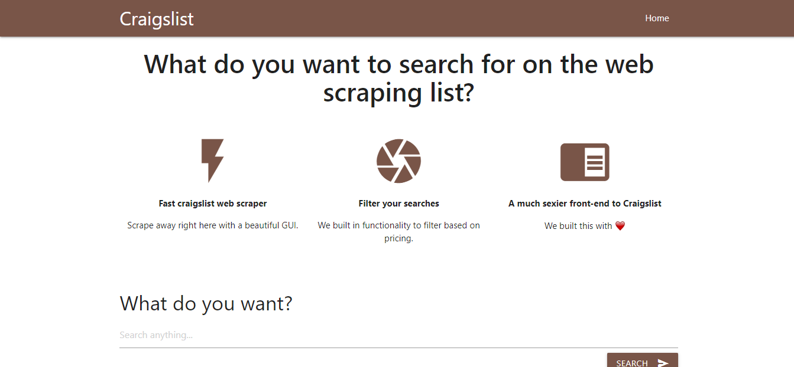
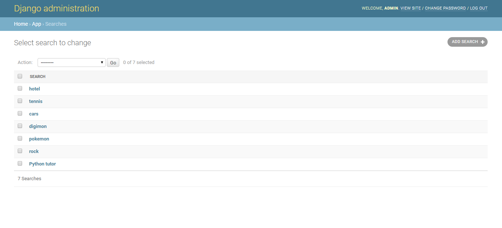

<h1 align="center">
   
  
    
  <a href="https://martinbobbio.github.io/frontend-ngrx">
    Sistema craigslist
  </a>
    
</h1>

## Descripción

Sistema para extraer de la busqueda de una página contenido html y devolverlo en formato JSON
 
Tencologías: Python, Django y Materialize css
   

### Home

### Busquedas

### Admin

